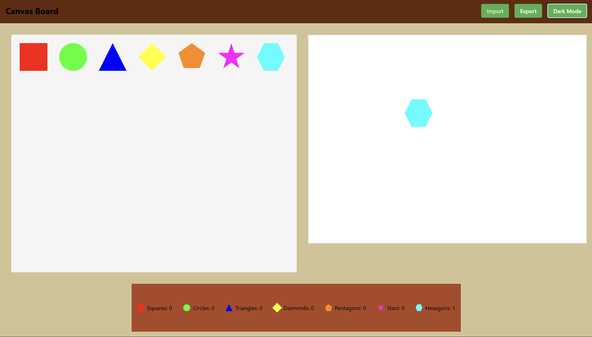

# پروژه‌ی طراحی با Canvas در React

این پروژه یک اپلیکیشن تحت وب ساده با استفاده از `React` است که به کاربر اجازه می‌دهد اشکال مختلفی مثل مربع، دایره، مثلث و ... را روی یک بوم رسم کند. کاربر می‌تواند رنگ، اندازه و چرخش اشکال را تغییر دهد، آن‌ها را جابه‌جا کند وپروژه را به صورت JSON ذخیره یا بازیابی نماید.



---

## امکانات اصلی

- رسم اشکال: مربع، دایره، مثلث، لوزی، پنج‌ضلعی، ستاره، شش‌ضلعی
- درگ و دراپ برای افزودن اشکال به بوم
- شمارش زنده تعداد اشکال از هر نوع
- تم تاریک و روشن
- قابلیت تغییر رنگ و چرخش هر شکل
- امکان ذخیره‌سازی و بازیابی نقاشی به‌صورت JSON
- طراحی ماژولار و قابل توسعه با استفاده از `React` و `styled-components`

---

## ساختار کلی پروژه

```
src/
├── components/
│   ├── Canvas.tsx              ← بوم اصلی نقاشی
│   ├── Shape.tsx               ← کامپوننت رندر هر شکل
│   ├── ShapeSelector.tsx       ← لیست اشکال قابل انتخاب
│   ├── ShapeCounter.tsx        ← شمارشگر تعداد اشکال
│   └── Toolbar.tsx             ← ابزارها (رنگ، ذخیره، بارگذاری، تم)
├── types.ts                    ← تعریف نوع‌ها (interface)
├── App.tsx                     ← کامپوننت اصلی برنامه
├── index.tsx                   ← نقطه شروع React
└── styles/
    └── globalStyles.ts         ← استایل‌های عمومی
```

---

## نحوه اجرای پروژه

۱. ابتدا پروژه را کلون کنید:

```bash
git clone https://github.com/soilorian/canvas-drawing-app-fe.git
cd canvas-drawing-app
```

۲. پکیج‌ها را نصب کنید:

```bash
npm install
```

۳. اجرای برنامه:

```bash
npm run dev
```

---

## فایل‌های مهم

### 1. types.ts

این فایل شامل ساختارهای داده‌ای اصلی پروژه است:

```ts
export interface Shape {
  id: string;
  type: 'square' | 'circle' | 'triangle' | 'diamond' | 'pentagon' | 'star' | 'hexagon';
  x: number;
  y: number;
  width: number;
  height: number;
  rotation: number;
  color: string;
}

export interface DrawingState {
  shapes: Shape[];
}

export interface ShapeCount {
  square: number;
  circle: number;
  triangle: number;
  diamond: number;
  pentagon: number;
  star: number;
  hexagon: number;
}
```

---

### 2. ShapeSelector.tsx

نمایش لیستی از اشکال برای انتخاب و درگ کردن:

- از طریق `defaultShapes` لیست اولیه اشکال مشخص شده‌اند.
- از `clip-path` برای اشکال خاص (مثل ستاره و پنج‌ضلعی) استفاده شده.
- درگ اشکال با `dataTransfer.setData` صورت می‌گیرد.

---

### 3. ShapeCounter.tsx

نمایش تعداد هر نوع شکل موجود روی بوم.

- از `styled-components` برای ساخت آیکن هر شکل استفاده شده.
- برای حالت تاریک کلاس `dark` به کامپوننت اضافه می‌شود.
- هر شکل با رنگ خاص خود نشان داده می‌شود.

---

### 4. Shape.tsx

کامپوننت اصلی برای رسم هر شکل که خصوصیات زیر را پشتیبانی می‌کند:

- موقعیت روی بوم (x, y)
- اندازه (width, height)
- رنگ
- چرخش (rotation)
- درگ برای جابه‌جایی

---

### 5. Canvas.tsx

مدیریت بوم اصلی و هندل رخدادهای دراپ، کلیک و بروزرسانی لیست اشکال.

---

## تم تاریک و روشن

با استفاده از پراپ `darkMode` که به کامپوننت‌های اصلی ارسال می‌شود، تم برنامه می‌تواند تغییر کند.

---

## ذخیره و بازیابی

شکل‌های روی بوم به صورت JSON ذخیره شده و در صورت نیاز مجدد بارگذاری می‌شوند. این امکان در نوار ابزار قرار دارد.

---

## تکنولوژی‌های استفاده شده

- `React`
- `Vite`
- `TypeScript`

---